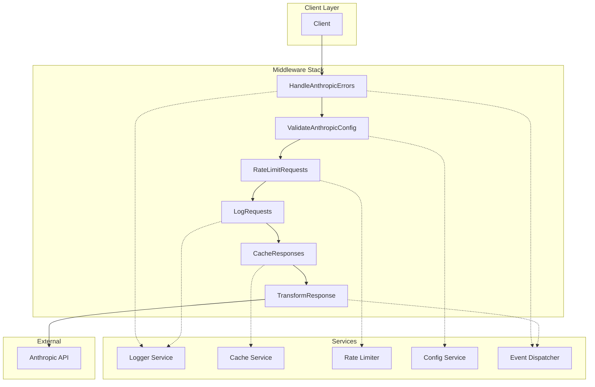
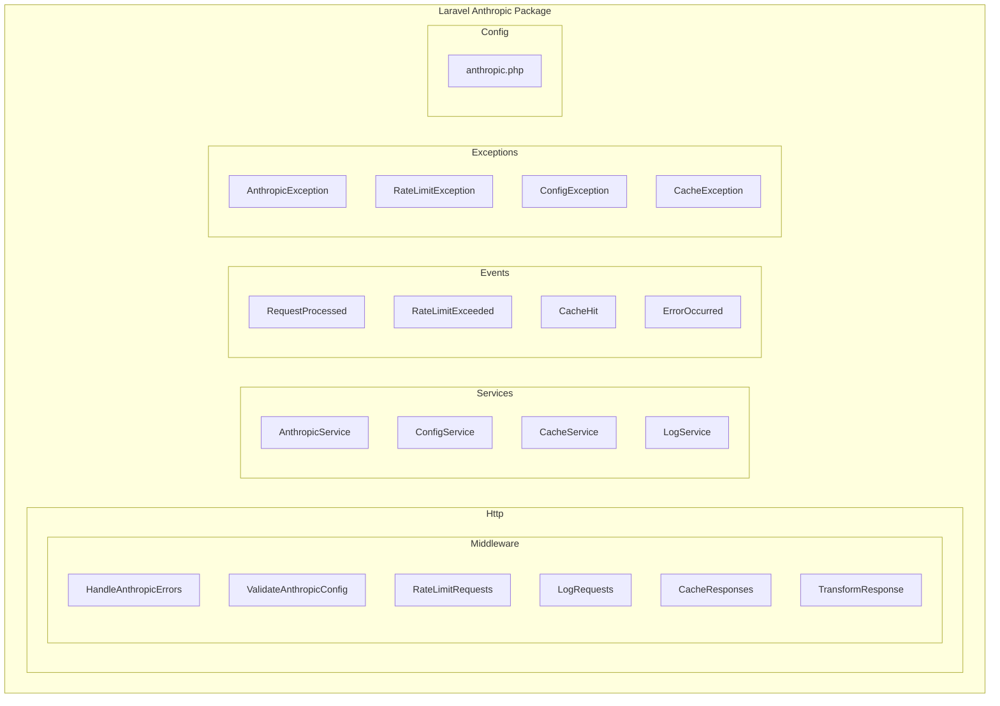
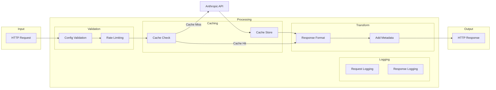
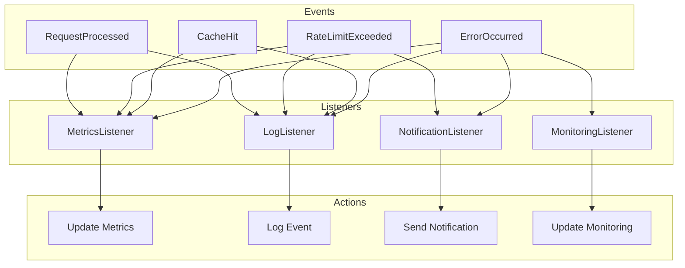

# Laravel Anthropic Middleware Architecture

This document provides architectural diagrams illustrating the structure and relationships of the middleware components.

## Class Diagram

```mermaid
classDiagram
    class Middleware {
        <<interface>>
        +handle(Request, Closure): Response
    }

    class HandleAnthropicErrors {
        -shouldIncludeDebugInfo(): bool
        -sanitizeContext(array): array
        +handle(Request, Closure): Response
        +handleException(Throwable): JsonResponse
        #formatError(Throwable): array
    }

    class ValidateAnthropicConfig {
        -requiredConfig: array
        +handle(Request, Closure): Response
        #validateConfig(): void
        #getRequiredConfig(): array
    }

    class RateLimitAnthropicRequests {
        -limiter: RateLimiter
        -config: array
        +handle(Request, Closure): Response
        #resolveRequestSignature(Request): string
        #handleRateLimitExceeded(int): JsonResponse
        #addRateLimitHeaders(Response, RateLimiter): void
    }

    class LogAnthropicRequests {
        -logger: Logger
        -config: array
        +handle(Request, Closure): Response
        #logRequest(Request): void
        #logResponse(Response): void
        #formatRequestData(Request): array
        #formatResponseData(Response): array
    }

    class CacheAnthropicResponses {
        -cache: Cache
        -config: array
        +handle(Request, Closure): Response
        #getCacheKey(Request): string
        #shouldCache(Request, Response): bool
        #cacheResponse(string, Response): void
        #getCachedResponse(string): ?Response
    }

    class TransformAnthropicResponse {
        -config: array
        +handle(Request, Closure): Response
        #shouldTransform(Response): bool
        #transformResponse(Response, float): array
        #getResponseData(Response): array
        #getResponseMessage(array, bool): ?string
        #getErrorDetails(array): ?array
        #isBinaryResponse(Response): bool
        #getPaginationMetadata(array): ?array
    }

    Middleware <|.. HandleAnthropicErrors
    Middleware <|.. ValidateAnthropicConfig
    Middleware <|.. RateLimitAnthropicRequests
    Middleware <|.. LogAnthropicRequests
    Middleware <|.. CacheAnthropicResponses
    Middleware <|.. TransformAnthropicResponse
```

## Component Diagram

## Package Structure

## Data Flow Diagram

## Event Flow Diagram

## Configuration Structure

```mermaid
graph TB
    subgraph Config File
        Root[anthropic.php]
        API[API Settings]
        Rate[Rate Limiting]
        Cache[Caching]
        Log[Logging]
        Response[Response]
    end

    Root --> API & Rate & Cache & Log & Response

    subgraph API Settings
        API --> Key[API Key]
        API --> URL[Base URL]
        API --> Version[API Version]
        API --> Timeout[Timeout]
    end

    subgraph Rate Limiting
        Rate --> Enabled[Enabled]
        Rate --> Max[Max Requests]
        Rate --> Window[Time Window]
        Rate --> Store[Storage]
    end

    subgraph Caching
        Cache --> CEnabled[Enabled]
        Cache --> TTL[TTL]
        Cache --> Driver[Cache Driver]
        Cache --> Tags[Cache Tags]
    end

    subgraph Logging
        Log --> LEnabled[Enabled]
        Log --> Channel[Log Channel]
        Log --> Level[Log Level]
        Log --> Format[Log Format]
    end

    subgraph Response
        Response --> Transform[Transform]
        Response --> Envelope[Envelope]
        Response --> Metadata[Metadata]
        Response --> Messages[Messages]
    end
```

These architectural diagrams provide:
- Class relationships and structure
- Component interactions
- Package organization
- Data flow patterns
- Event handling system
- Configuration hierarchy

The diagrams help understand:
- System architecture
- Code organization
- Dependencies
- Data flow
- Configuration structure
- Extension points
