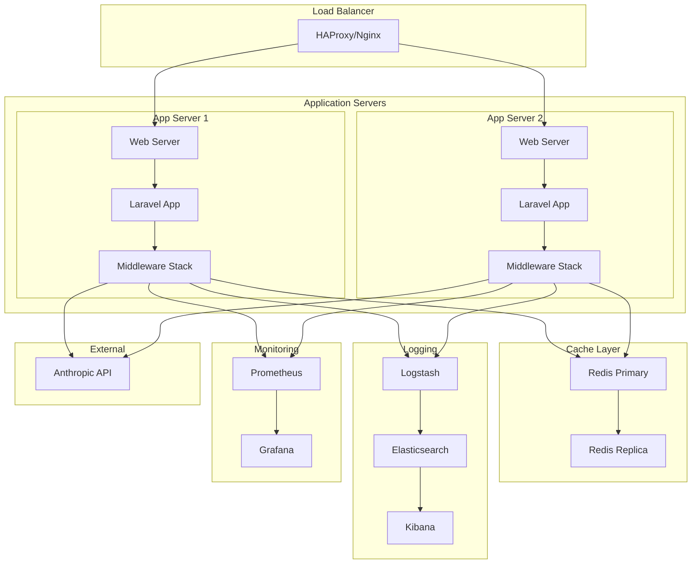
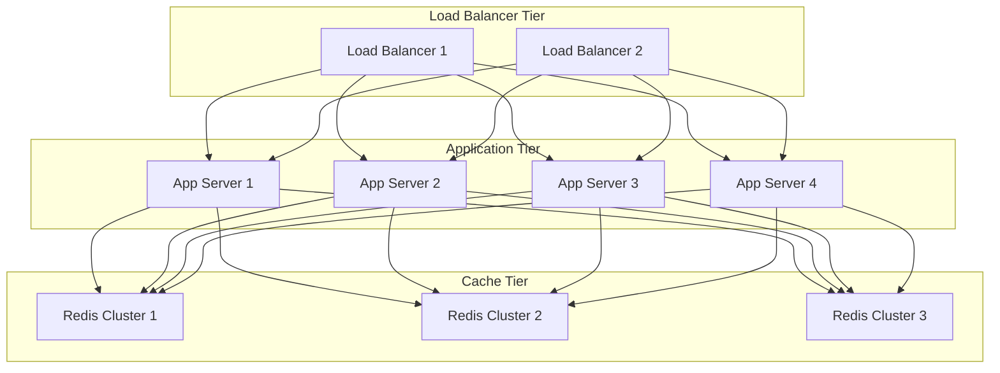
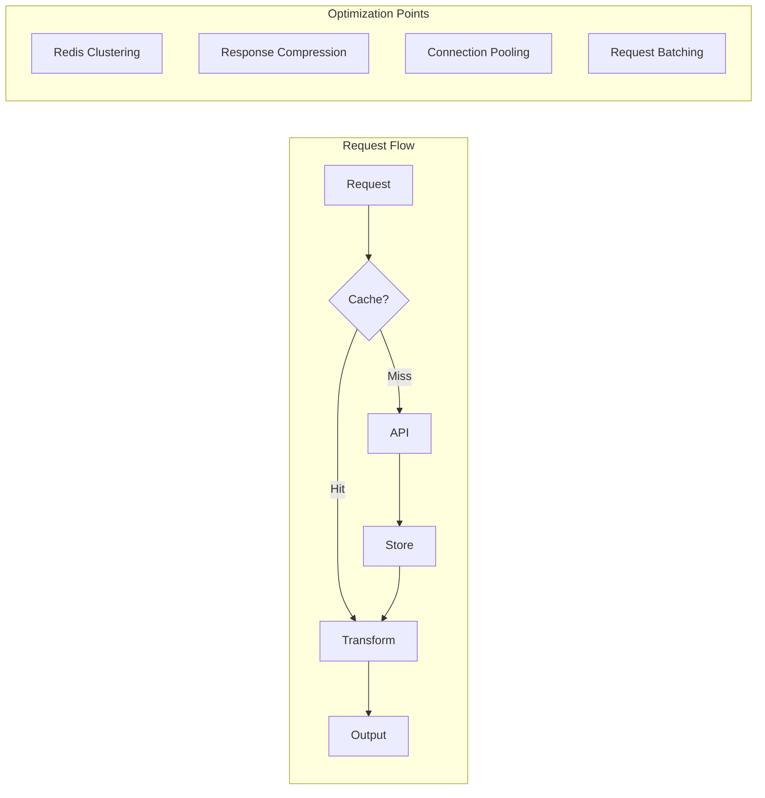

# Laravel Anthropic Middleware Deployment Guide

This document provides deployment diagrams and infrastructure configurations for different environments.

## Production Deployment



## Infrastructure Requirements

### Application Servers
```yaml
app_server:
  cpu: 4 cores
  memory: 16GB
  disk: 100GB SSD
  os: Ubuntu 22.04 LTS
  php: 8.2
  nginx: 1.24
  supervisor: 4.2
```

### Cache Layer
```yaml
redis:
  primary:
    memory: 8GB
    persistence: yes
    maxmemory-policy: allkeys-lru
  replica:
    memory: 8GB
    replication: yes
    read-only: yes
```

### Logging Stack
```yaml
elasticsearch:
  version: 8.x
  memory: 16GB
  disk: 500GB SSD
  replicas: 2

logstash:
  memory: 4GB
  workers: 4

kibana:
  memory: 2GB
```

### Monitoring Stack
```yaml
prometheus:
  retention: 30d
  disk: 200GB
  scrape_interval: 15s

grafana:
  memory: 2GB
  plugins:
    - redis-datasource
    - elasticsearch-datasource
```

## Environment Configurations

### Production
```env
# API Configuration
ANTHROPIC_API_KEY=prod-key
ANTHROPIC_API_VERSION=2024-01-01
ANTHROPIC_API_TIMEOUT=30

# Rate Limiting
ANTHROPIC_RATE_LIMITING_ENABLED=true
ANTHROPIC_RATE_LIMIT_MAX_REQUESTS=60
ANTHROPIC_RATE_LIMIT_DECAY_MINUTES=1

# Caching
ANTHROPIC_CACHE_ENABLED=true
ANTHROPIC_CACHE_TTL=3600
ANTHROPIC_CACHE_DRIVER=redis
ANTHROPIC_CACHE_PREFIX=prod:anthropic:

# Logging
ANTHROPIC_LOGGING_ENABLED=true
ANTHROPIC_LOG_CHANNEL=stack
ANTHROPIC_LOG_LEVEL=error

# Response Transformation
ANTHROPIC_TRANSFORM_ENABLED=true
ANTHROPIC_INCLUDE_METADATA=true
```

### Staging
```env
# API Configuration
ANTHROPIC_API_KEY=staging-key
ANTHROPIC_API_VERSION=2024-01-01
ANTHROPIC_API_TIMEOUT=60

# Rate Limiting
ANTHROPIC_RATE_LIMITING_ENABLED=true
ANTHROPIC_RATE_LIMIT_MAX_REQUESTS=100
ANTHROPIC_RATE_LIMIT_DECAY_MINUTES=1

# Caching
ANTHROPIC_CACHE_ENABLED=true
ANTHROPIC_CACHE_TTL=1800
ANTHROPIC_CACHE_DRIVER=redis
ANTHROPIC_CACHE_PREFIX=staging:anthropic:

# Logging
ANTHROPIC_LOGGING_ENABLED=true
ANTHROPIC_LOG_CHANNEL=stack
ANTHROPIC_LOG_LEVEL=debug

# Response Transformation
ANTHROPIC_TRANSFORM_ENABLED=true
ANTHROPIC_INCLUDE_METADATA=true
```

### Development
```env
# API Configuration
ANTHROPIC_API_KEY=dev-key
ANTHROPIC_API_VERSION=2024-01-01
ANTHROPIC_API_TIMEOUT=120

# Rate Limiting
ANTHROPIC_RATE_LIMITING_ENABLED=false
ANTHROPIC_RATE_LIMIT_MAX_REQUESTS=0
ANTHROPIC_RATE_LIMIT_DECAY_MINUTES=1

# Caching
ANTHROPIC_CACHE_ENABLED=false
ANTHROPIC_CACHE_TTL=60
ANTHROPIC_CACHE_DRIVER=file
ANTHROPIC_CACHE_PREFIX=dev:anthropic:

# Logging
ANTHROPIC_LOGGING_ENABLED=true
ANTHROPIC_LOG_CHANNEL=single
ANTHROPIC_LOG_LEVEL=debug

# Response Transformation
ANTHROPIC_TRANSFORM_ENABLED=true
ANTHROPIC_INCLUDE_METADATA=true
```

## Scaling Considerations

### Horizontal Scaling


### Performance Optimization


## Monitoring Setup

### Metrics Collection
```yaml
middleware_metrics:
  - request_duration_seconds:
      type: histogram
      buckets: [0.1, 0.5, 1, 2, 5]
  - cache_hit_ratio:
      type: gauge
  - rate_limit_remaining:
      type: gauge
  - error_count:
      type: counter
      labels: [type, status]
```

### Alert Rules
```yaml
alerts:
  high_error_rate:
    condition: error_rate > 5%
    duration: 5m
    severity: critical

  rate_limit_approaching:
    condition: rate_limit_remaining < 10
    duration: 1m
    severity: warning

  cache_hit_ratio_low:
    condition: cache_hit_ratio < 0.8
    duration: 15m
    severity: warning
```

## Deployment Checklist

1. **Pre-deployment**
   - [ ] Validate configuration
   - [ ] Check API credentials
   - [ ] Test rate limiting
   - [ ] Verify cache connection
   - [ ] Configure logging

2. **Deployment**
   - [ ] Update environment variables
   - [ ] Deploy middleware stack
   - [ ] Verify monitoring
   - [ ] Check error handling
   - [ ] Test response transformation

3. **Post-deployment**
   - [ ] Monitor error rates
   - [ ] Check cache hit ratio
   - [ ] Verify rate limiting
   - [ ] Review logs
   - [ ] Test failover

## Backup and Recovery

### Cache Persistence
```yaml
redis:
  backup:
    frequency: hourly
    retention: 7 days
    type: RDB
  recovery:
    max_downtime: 5 minutes
    procedure: automatic
```

### Log Retention
```yaml
logging:
  retention:
    error: 90 days
    info: 30 days
    debug: 7 days
  archival:
    type: S3
    compression: gzip
    schedule: daily
```

These deployment configurations provide:
- Infrastructure requirements
- Environment-specific settings
- Scaling considerations
- Monitoring setup
- Deployment procedures
- Backup strategies

The diagrams and configurations help with:
- System architecture
- Resource allocation
- Performance optimization
- Monitoring and alerting
- Deployment automation
- Disaster recovery
