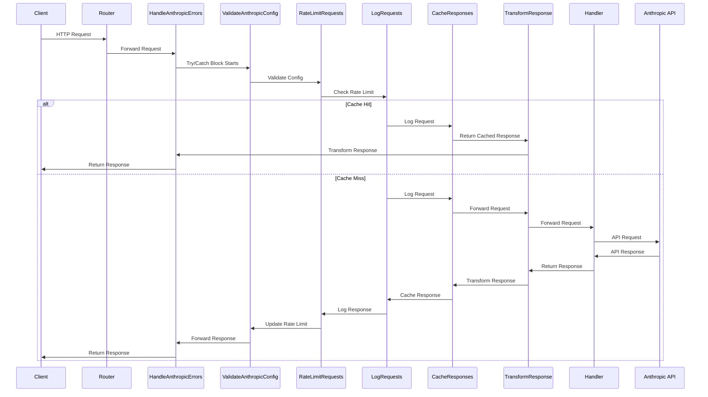
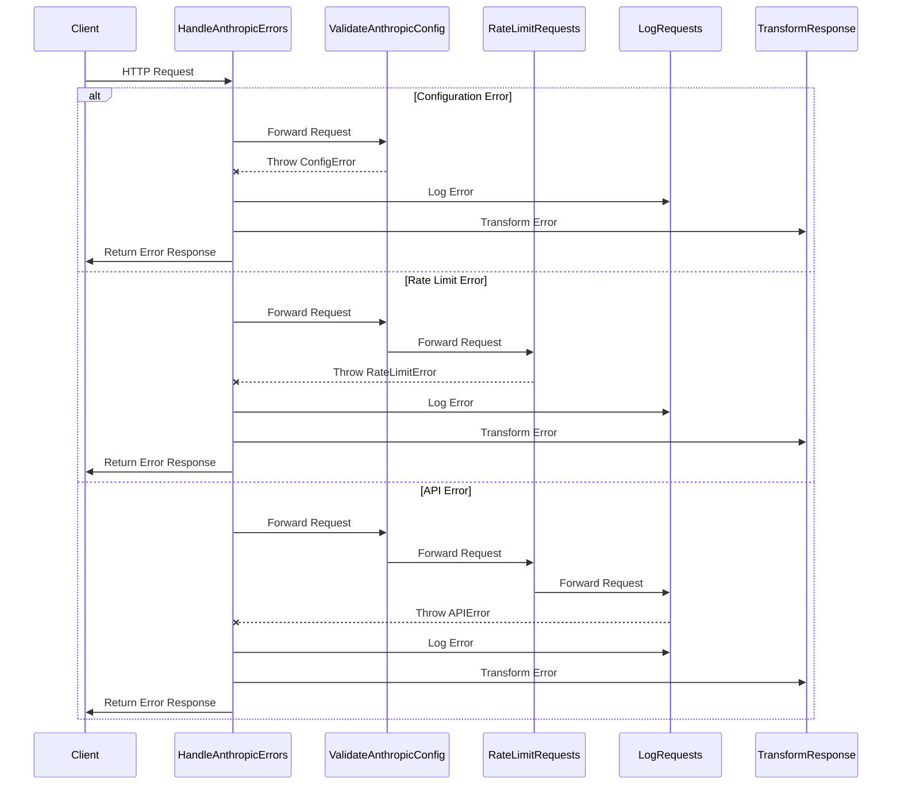
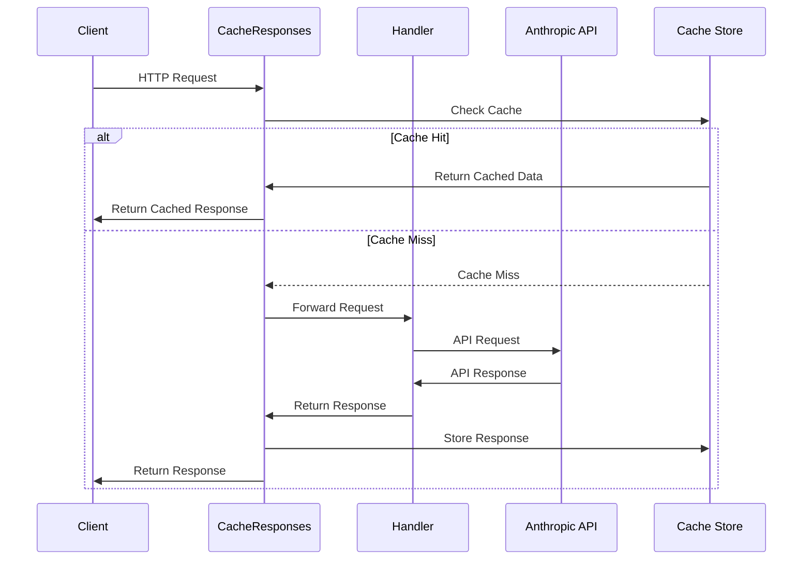
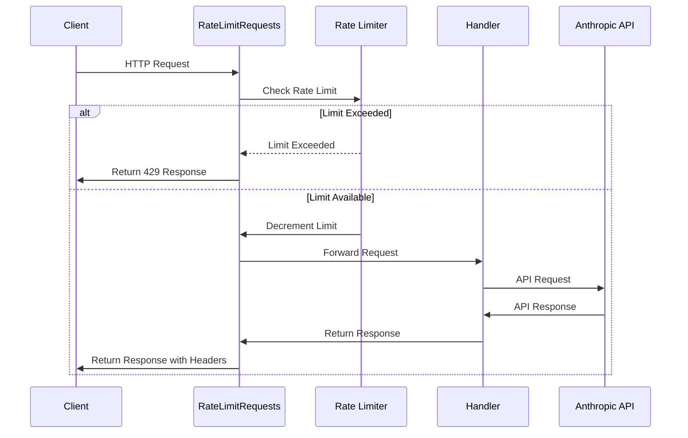
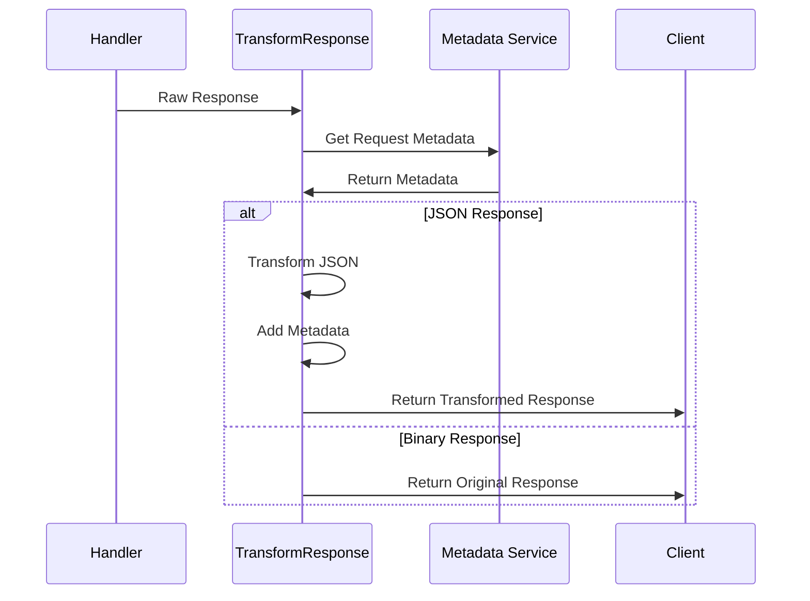
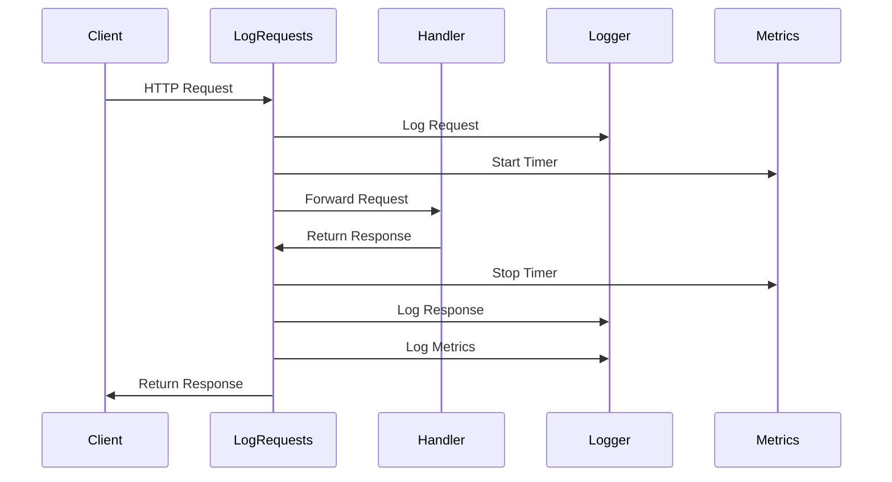
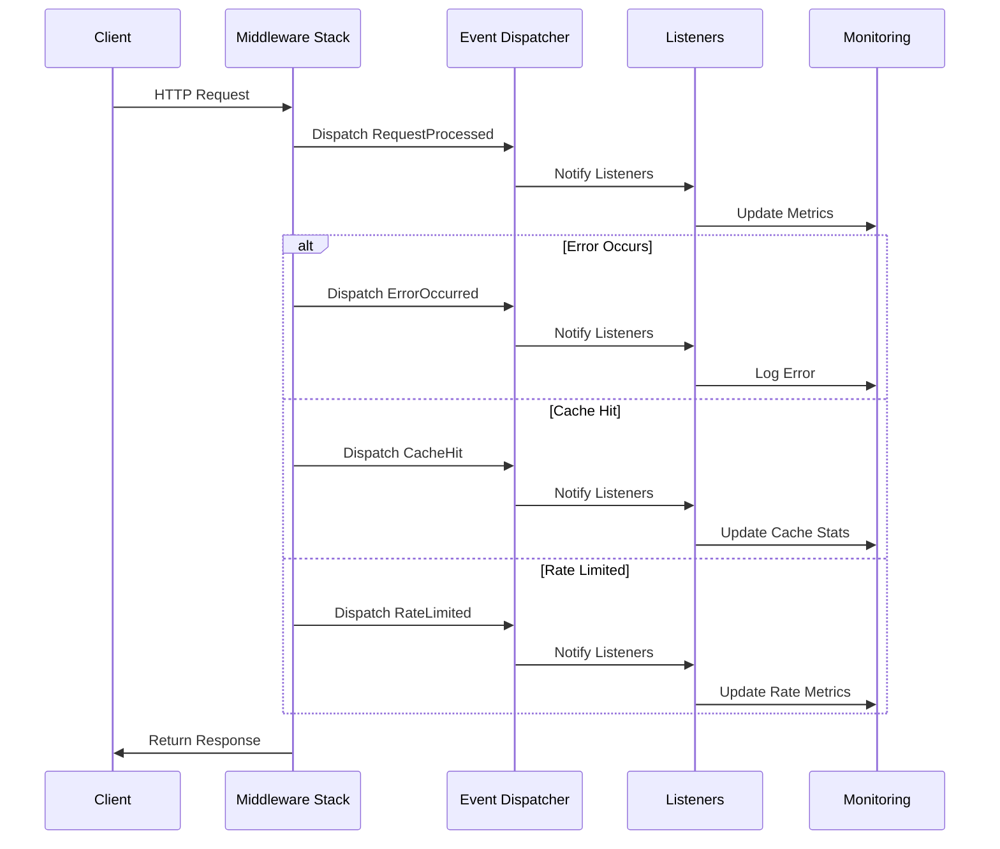

# Laravel Anthropic Middleware Sequence Diagrams

This document provides sequence diagrams illustrating the flow and interactions within the middleware stack.

## Basic Request Flow

## Error Handling Flow

## Caching Flow

## Rate Limiting Flow

## Response Transformation Flow

## Logging Flow

## Event Flow

These sequence diagrams illustrate:
- Complete request lifecycle
- Error handling paths
- Caching mechanisms
- Rate limiting logic
- Response transformation
- Logging and monitoring
- Event dispatching

The diagrams help visualize:
- Component interactions
- Decision points
- Data flow
- Error paths
- Asynchronous operations
- System boundaries
